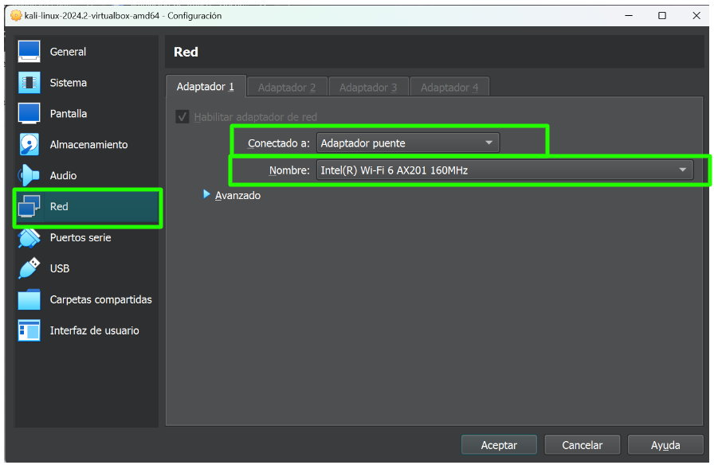
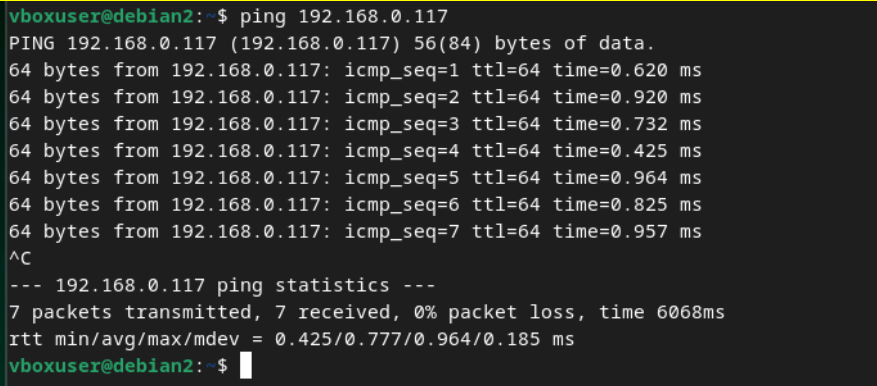
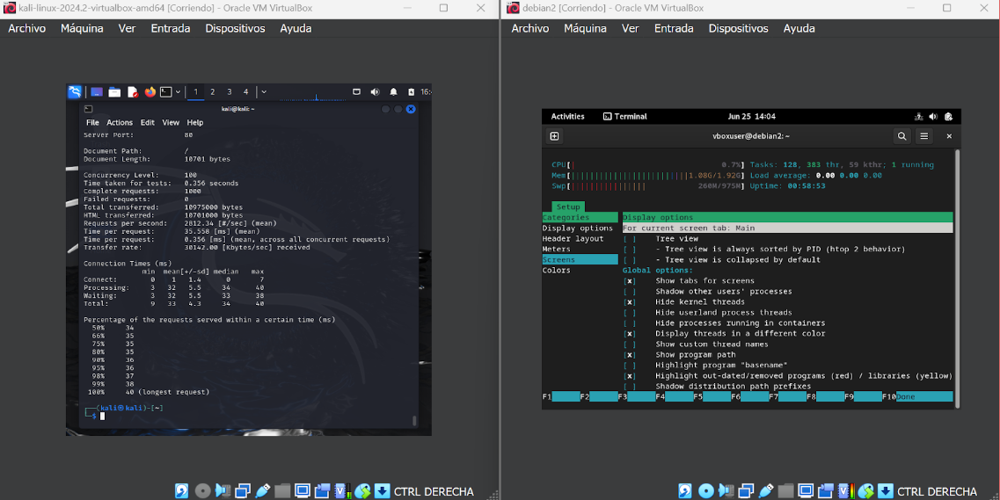

<!-- hide -->
# Simulación de trafico al sitio wordpress
<!-- endhide -->
Este proyecto tiene como objetivo generar tráfico artificial desde una máquina Kali Linux hacia un sitio web alojado en un servidor Debian, utilizando la herramienta Apache Benchmark (ab). Además, se implementarán herramientas de monitoreo en el servidor para detectar las oleadas de peticiones y evaluar su desempeño.

<!-- hide -->
> By [@rosinni](https://github.com/rosinni) and [other contributors](https://github.com/4GeeksAcademy/deploying-wordpress-debian/graphs/contributors) at [4Geeks Academy](https://4geeksacademy.co/)


[](https://4geeks.com)
[](https://twitter.com/4geeksacademy)

*These instructions are [available in english](https://github.com/breatheco-de/traffic-simulation-on-wordpress/blob/main/README.md)*

### Antes de empezar...

> ¡Te necesitamos! Estos ejercicios se crean y mantienen en colaboración con personas como tú. Si encuentras algún error o falta de ortografía, contribuye y/o repórtalo.
<!-- endhide -->

## 🌱 ¿Cómo empezar este proyecto?

### Instalación local:

No clones ningún repositorio, solo sigue las siguientes instrucciones:

### Requisitos

Para llevar a cabo este proyecto vamos a necesitar 2 maquinas virtuales. Una de ellas será la maquina virtual de debian donde construimos el sitio web de wordpress anteriormente y la otra la maquina atacante con kali.

* Oracle VirtualBox
* Máquina virtual con Kali Linux (Atacante): Para generar el tráfico.
* Máquina virtual con Debian (Servidor Web): Donde tenemos alojado el servidor Apache y el sitio WordPress.

## 📝 Instrucciones

### Paso 1: Configurar la Red en VirtualBox

#### Configurar la Red de la Máquina Debian (Servidor Web)

- [ ] Abre VirtualBox.
- [ ] Selecciona tu máquina virtual con Debian y haz clic en "Configuración".
- [ ] Ve a la sección "Red" y asegúrate de que el "Adaptador 1" esté habilitado y configurado como "Adaptador puente".
- [ ] En el campo "Nombre", selecciona el adaptador de red física que deseas usar (el que tu host está utilizando para conectarse a la red, como Wi-Fi o Ethernet). Esto suele ser algo como "Intel(R) Ethernet Connection" o "Wi-Fi".
- [ ] Guarda los cambios y cierra la ventana de configuración.


#### Configurar la Red de la Máquina Kali Linux (Atacante)

- [ ] Selecciona tu máquina virtual con Kali Linux y haz clic en "Configuración".
- [ ] Ve a la sección "Red" y asegúrate de que el "Adaptador 1" esté habilitado y configurado como "Adaptador puente".
- [ ] En el campo "Nombre", selecciona **el mismo adaptador de red** física que seleccionaste para la máquina Debian.
- [ ]  Guarda los cambios y cierra la ventana de configuración.



### Paso 2: Obtener la Dirección IP de las Máquinas para poderlas conectar entre sí.

Con "Bridged Adapter" configurado, las máquinas deberían obtener automáticamente una dirección IP de su router o del servidor DHCP de la red.

#### En la Máquina Debian (Servidor Web):

- [ ] Inicia la máquina virtual Debian.
- [ ] Abre una terminal y ejecuta el comando `$ ip addr show` para ver la dirección IP asignada:

Busca la sección correspondiente a tu interfaz de red (usualmente `eth0` o `enp0s3`) y encuentra la línea que dice inet. Ahí verás la dirección IP asignada, algo como `192.168.1.x`.

#### En la Máquina Kali Linux (Atacante)

- [ ] Inicia la máquina virtual Kali Linux.
- [ ] Abre una terminal y ejecuta el comando `$ ip addr show` para ver la dirección IP asignada:

Busca la sección correspondiente a tu interfaz de red (usualmente `eth0` o `enp0s3`) y encuentra la línea que dice inet. Ahí verás la dirección IP asignada, algo como `192.168.1.x`.

### PASO 3: Verificar la Conexión Entre las Máquinas

#### Desde la Máquina Kali Linux (Atacante)

- [ ] Abre una terminal y haz ping a la máquina Debian para verificar la conexión:

```bash
$ ping <IP_debian>
```

> Reemplaza <IP_debian> con la dirección IP que obtuviste para la máquina Debian.

#### Desde la Máquina Debian (Servidor Web)

- [ ] Abre una terminal y haz ping a la máquina Kali Linux para verificar la conexión:

```bash
$ ping <IP_kali>
```

> Reemplaza <IP_kali> con la dirección IP que obtuviste para la máquina Kali.

Ejemplo gráfico de cómo se ven los ping al estar conectados


### PASO 4: Simular Tráfico en el Sitio Web

#### En la Máquina Kali Linux (Atacante)

Usaremos como herramienta ab (Apache Benchmark) para generar tráfico en el sitio web. 

#### Instalación y Uso de Apache Benchmark

Apache Benchmark (ab) es una herramienta que permite generar tráfico de prueba hacia un servidor web. Sigue estos pasos para instalar y usar AB desde Kali Linux:

1. Instalación de Apache Benchmark

```bash
$ sudo apt-get update
$ sudo apt-get install apache2-utils
```

2. Generar Tráfico hacia el Sitio Web

```bash
$ ab -n 1000 -c 10 http://<IP_debian>/
```
***El comando `ab -n 1000 -c 10 http://<IP_debian>/` hará que Apache Bench envíe 1000 peticiones HTTP al servidor web en la dirección http://<IP_debian>/, con 10 peticiones realizándose al mismo tiempo, simulando 10 usuarios concurrentes accediendo al servidor.***

> NOTA: Reemplaza <IP_debian> con la dirección IP del servidor Debian.

### Paso 5: Monitoreo del Desempeño del Servidor

En el servidor Debian, vamos a instalar herramientas de monitoreo como htop para observar el desempeño durante las pruebas.

#### Instalación de htop

```bash
$ sudo apt-get update
$ sudo apt-get install htop
```

### Monitoreo en Tiempo Real con htop

`htop` es una herramienta interactiva de monitoreo de procesos que proporciona una visión detallada del uso de recursos del sistema. 

- [ ] Ejecuta el siguiente comando la terminal para monitorear el uso de CPU, memoria y otros recursos del sistema en tiempo real mientras se ejecutan las pruebas con Apache Benchmark.

```bash
$ htop
```

Veras algo como esto:


* CPU Usage (Uso de CPU): Muestra el uso de la CPU en tiempo real, generalmente dividido en barras que representan cada núcleo de la CPU.
* Memory Usage (Uso de Memoria): Muestra el uso de la memoria RAM y swap.
* Tasks (Tareas/Procesos): Lista de procesos activos, con detalles como el PID, usuario, uso de CPU y memoria tiempo de ejecución, y el comando que inició el proceso.
* Load Average (Carga Media): Muestra el promedio de carga del sistema en los últimos 1, 5 y 15 minutos.
* Uptime (Tiempo de Actividad): Indica cuánto tiempo ha estado funcionando el sistema desde el último reinicio.

## Entrega de proyecto

En el repositorio que se ha clonado debes entregar 2 informes.

- [ ] El primero con el nombre `report_ab.txt`. Este lo debes generar a la hora de hacer el ataque en tu maquina virtual kali, con el siguiente comando:

```bash
$ ab -n 5000 -c 200 http://<IP_debian>/ > reporte_ab.txt
```

- [ ] El segundo lo debes crear con el nombre `report_htop.txt` que incluya las observaciones del desempeño del servidor en tu maquina debian mientras usas htop. 

> ***Copia estas lineas en el archivo `report_htop.txt` y llena lo que corresponda.***
```yml
  observations:
  evaluation_if_server_could_handle_load:
    - performance_metrics:
        - stable_memory: # Aquí puedes poner con cuantas solicitudes por segundo mantuvo una memoria estable
        - cpu_load_average: # Aquí puedes poner qué porcentaje de carga promedio mantuvo el CPU

  specification_of_excessive_resource_usage:
    - cpu_peak_usage:
        - observed: true  # Indica si se observaste un pico de uso de CPU del 90% durante los primeros minutos de carga máxima (el valor seria true o false)
        - peak_percentage: 90
        - request_count_at_peak:
            - value:  # Aquí puedes poner el número específico de peticiones con el que se hizo el pico

```

<!-- hide -->
## Colaboradores

Gracias a estas personas maravillosas ([emoji key](https://github.com/kentcdodds/all-contributors#emoji-key)):

1. [Rosinni Rodríguez (rosinni)](https://github.com/rosinni) contribución: (build-tutorial) ✅, (documentación) 📖
  
2. [Alejandro Sanchez (alesanchezr)](https://github.com/alesanchezr),  contribución: (detector bugs) 🐛

3. [Lorena Gubaira (lorenagubaira)](https://github.com/lorenagubaira), contribution: (detector bugs) 🐛, contribution: (editor), (tranducción) 🌎

Este proyecto sigue la especificación [all-contributors](https://github.com/kentcdodds/all-contributors). ¡Todas las contribuciones son bienvenidas!

Este y otros ejercicios son usados para [aprender a programar](https://4geeksacademy.com/es/aprender-a-programar/aprender-a-programar-desde-cero) por parte de los alumnos de 4Geeks Academy [Coding Bootcamp](https://4geeksacademy.com/us/coding-bootcamp) realizado por [Alejandro Sánchez](https://twitter.com/alesanchezr) y muchos otros contribuyentes. Conoce más sobre nuestros [Cursos de Programación](https://4geeksacademy.com/es/curso-de-programacion-desde-cero?lang=es) para convertirte en [Full Stack Developer](https://4geeksacademy.com/es/coding-bootcamps/desarrollador-full-stack/?lang=es), o nuestro [Data Science Bootcamp](https://4geeksacademy.com/es/coding-bootcamps/curso-datascience-machine-learning).Tambien puedes adentrarte al mundo de ciberseguridad con nuestro [Bootcamp de ciberseguridad](https://4geeksacademy.com/es/coding-bootcamps/curso-ciberseguridad).
<!-- endhide -->
